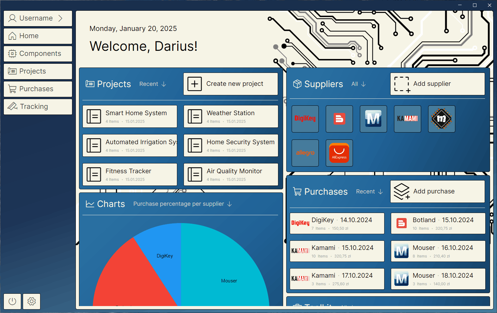
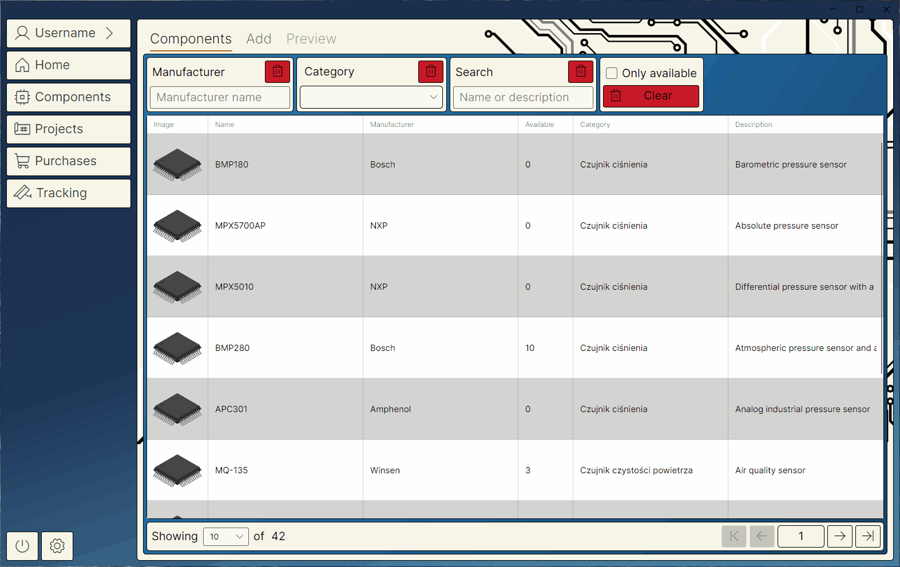
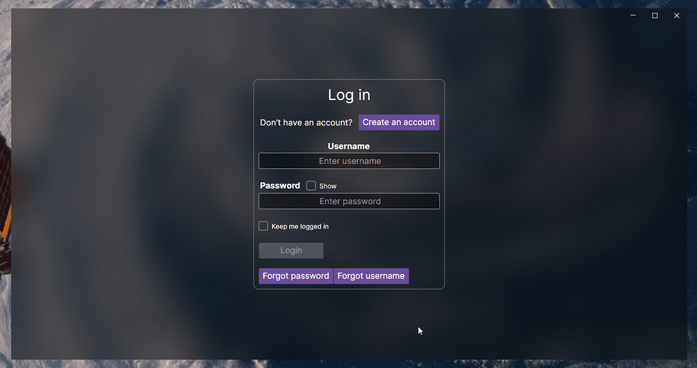

# ⚡ ElectroDepot  

**ElectroDepot** is a **inventory management application** for electronic components. It helps electronics enthusiasts and professionals keep track of their **integrated circuits (ICs)** and other parts, solving the common problem of losing track of components or making unnecessary purchases.  

The application leverages a **client-server architecture** to maintain a digital inventory and integrates with popular electronic component sellers like **DigiKey** and **Mouser**. Users can automatically **update their inventory** when new parts are ordered or delivered.  

ElectroDepot is much more than an Excel spreadsheet for managing IC names:  
- It provides an intuitive interface to organize components into **projects**.  
- It simplifies access to sellers for specific parts.  

ElectroDepot aims to be the **go-to application** for every electronics enthusiast striving to organize their workflow efficiently.  

### If you’re interested in the **technology stack** used to develop this system, check out the [Architecture and Technologies Information](#architecture-and-technologies-information) section.

---

## 🎯 Purpose  

ElectroDepot was created to solve the widespread problem of **disorganized component storage**.  

As an embedded systems enthusiast, I often struggled to keep track which components I used in certain projects or determine whether I already had parts in storage before purchasing duplicates. Many users face similar challenges. Ofter components get forgotten in boxes or drawers and projects become difficult to plan due to uncertainty about component availability.  

ElectroDepot addresses these issues by:  
- Keeping a clear **digital record** of components.  
- Tracking their usage across **projects**.  
- Automating updates when new parts are ordered or delivered.  

With ElectroDepot, users can **save time**, and improve project planning.  

---

## 🚀 Key Features  

ElectroDepot offers a solution for electronics enthusiasts and professionals by providing:  

- **Digital Inventory Management**: Always know what components are on hand.  
- **Project Organization**: Link parts to specific projects for better tracking.  
- **Integration with Popular Sellers**: Connect with DigiKey, Mouser, and other suppliers to update inventory seamlessly when ordering new parts.  
- **Searchable Interface**: Quickly find components and check their availability.  
- **Automated Updates**: Ensure inventory stays up-to-date with new purchases or deliveries.  

ElectroDepot is designed to be the tool for organizing components, and ensuring electronics enthusiasts and professionals always have a clear overview of their **inventory** and **projects**.  

---

## 📊 Current State of Development  

### Desktop Client Application  
For now top priority is to write usable desktop application. Next steps will involve porting this app to other platforms.

#### Functionalities implemented
- **Home page**  
  

- **Components page**
  - **Components tab**  
       
  - **Add tab**  
        
  - **Preview tab**  
        

#### Refactoring needed
- **Components**  
  
- **Purchases**  
  
- **Projects**  

- **User Login and Registration**  

---

### 🌐 Cross-Platform Client Application  
Development will begin **after the desktop application is completed**.  

---

### 🔧 Server  
- **Status**: Core functionality is implemented  
- **Next Steps**: Perform code refactoring as needed  

---

### 🛒 Parts Distributors Purchase Tracking Service  
Development has **not yet started**.  

---

## Architecture and Technologies Information  

  
Display details

  

  
### 🛠️ Technology Stack  

#### 🌐 Server  
- **Language**: C#  
- **Framework**: ASP.NET Core 8  
- **ORM**: Entity Framework  
- **Database**: MS SQL  

#### 💻 Client  
- **Language**: C#  
- **Framework**: .NET 8  
- **UI Library**: AvaloniaUI 11.0.7  

#### 🛒 Purchase Tracking Module  
- **Language**: C#  
- **Framework**: .NET 8  

#### 🧪 Testing  
- **Framework**: XUnit  

---

### 📦 Project Solution Overview  

1. **🌐 Server**  
   - Handles backend architecture, REST API development, and image upload/storage procedures.  

2. **💻 Desktop Client**  
   - A desktop application built with **C#** and the **AvaloniaUI** library.  
   - Future-proof design to enable **cross-platform migration** after development completion.  

3. **🔗 ElectroDepotClassLibrary**  
   - A shared library for **data exchange** between the server and client.  
   - Provides basic functionalities and reusable client-side code.  

4. **🧪 ElectroDepotClassLibraryTests**  
   - Includes tests for server endpoints and client-side code using **XUnit**.  

  

