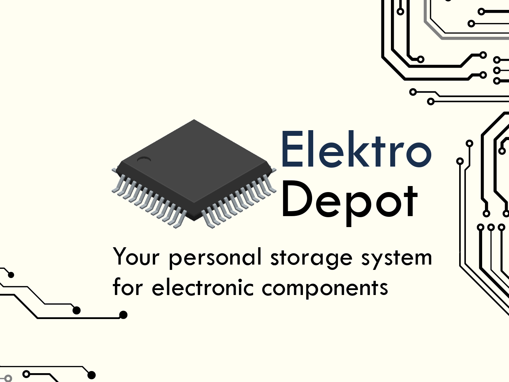

  

**ElectroDepot** is a inventory management application for electronic components. It helps to keep track of integrated circuits (ICs) and other parts, solving the common problem of losing track of components or making unnecessary purchases. The application leverages a client-server architecture to maintain a digital inventory. Users can update their inventory when new parts are ordered or delivered.  

<h2 id="custom-sections">Sections</h2>

1. <a href="#custom-purpose" style="font-size: 1.2em; color: blue;">**Purpose**</a>  
2. <a href="#custom-key-features" style="font-size: 1.2em; color: blue;">**Features**</a>  
3. <a href="#architecture-and-technologies-information" style="font-size: 1.2em; color: blue;">**Current State of Development**</a>  
4. <a href="#custom-future-improvements-goals" style="font-size: 1.2em; color: blue;">**Future Improvements / Goals**</a>  
5. <a href="#custom-architecture-and-technologies-information" style="font-size: 1.2em; color: blue;">**Architecture and Technologies Information**</a>  
6. <a href="#custom-instalation-guide" style="font-size: 1.2em; color: blue;">**Installation Guide**</a>  
---

#### [⬅️ Go back](#custom-sections)
<h2 id="custom-purpose">🎯 Purpose</h2>
ElectroDepot was created to solve the problem of disorganized component storage. As an embedded systems enthusiast, I often struggled to keep track of which components I used in certain projects or determine whether I already had parts in storage before purchasing duplicates. Many users face similar challenges. Often, components get forgotten in boxes or drawers, making it difficult to plan projects due to uncertainty about component availability.

ElectroDepot addresses these issues by:
- Maintaining a clear digital record of components.
- Organizing purchased components into categorized purchases.
- Tracking component usage across projects.

It is important to note that the application itself was a result of the learning process for the AvaloniaUI framework. I am aware of the bugs present in the code, and some parts may not follow best coding practices. However, considering that one of the main goals of writing this app was to learn a new framework, these inconveniences can be overlooked.

---
#### [⬅️ Go back](#custom-sections)
<h2 id="custom-key-features">🚀 Key Features </h2>
ElectroDepot offers a solution for electronics enthusiasts and professionals by providing:  

- **Digital Inventory Management**: Always know what components are on hand.  
- **Project Organization**: Link parts to specific projects for better tracking.  
- **Integration with Popular Sellers**: Connect with DigiKey, Mouser, and other suppliers to update inventory seamlessly when ordering new parts.  
- **Searchable Interface**: Quickly find components and check their availability.  
- **Interface**: Provides an intuitive interface to organize components into projects.  
- **Components**: Simplifies access to sellers for specific parts.  
---
#### [⬅️ Go back](#custom-sections)
## 📊 Current State of Development  

### Desktop Client Application  
For now top priority is to write usable desktop application. Next steps will involve porting this app to other platforms.

#### Home


---
#### Components


---
#### Projects


---
#### Purchases


---
#### [⬅️ Go back](#custom-sections)
<h2 id="custom-future-improvements-goals">✔ Future improvements and goals</h2>

- **Port ElectroDepot to Android, iOS, and Web platforms.**  
- **Bug Fixes**  
- **Visual Improvements**  
- **Develop 'Purchase Tracking Service'**  
  - Enable users to link purchases from DigiKey, Mouser, and other component suppliers into a unified platform like ElectroDepot.

---

#### [⬅️ Go back](#custom-sections)
<h2 id="custom-architecture-and-technologies-information"> 🌐 Architecture and Technologies Information </h2>
The choice of technologies for ElectroDepot was driven by my desire to develop skills in areas that interest me. I selected C# and ASP.NET Core for the server-side development, as I aim to deepen my expertise in modern backend technologies. Entity Framework and MS SQL were natural choices to complement this stack.
On the client side, I opted for AvaloniaUI, as I wanted to learn a cross-platform UI framework that allows building desktop applications with a modern approach.
Additionally, I used Docker for containerization, as I wanted to gain hands-on experience with concepts related to containerized deployments and infrastructure management. This allowed me to explore best practices in software deployment while improving my overall understanding of DevOps workflows.
For testing, I chose XUnit to ensure code reliability and maintainability.

#### 🌐 Server  
- **Language**: C#  
- **Framework**: ASP.NET Core 8  
- **ORM**: Entity Framework  
- **Database**: MS SQL  

#### 💻 Client  
- **Language**: C#  
- **Framework**: .NET 9  
- **UI Library**: AvaloniaUI 11.0.7  

#### 🧪 Testing  
- **Framework**: XUnit  

#### 🐳 Containerization
- **Docker**


## 📦 Visual Studio Solution Overview  

The ElectroDepot solution is structured into multiple projects, each serving a distinct purpose. Below is an overview of the key components within the solution:  

### 1. 🌐 Server  
   - Manages backend architecture, including API endpoints and image upload/storage procedures.  

### 2. 💻 Desktop Client  
   - A cross-platform desktop application built with **C#** and the **AvaloniaUI** framework.  

### 3. 💻 Desktop Client Installer  
   - Generates `.msi` installers and setup files for **Windows**, and setup file for other platforms sucha as: **macOS or Linux**.  

### 4. 🐳 Docker-Compose  
   - Defines containerized environments for seamless deployment using **Docker Compose**.  

### 5. 🔗 ElectroDepotClassLibrary  
   - A shared library facilitating **data exchange** between the server and client.  
   - Provides essential functionalities and reusable client-side logic.  

### 6. 🧪 ElectroDepotClassLibraryTests  
   - Contains automated tests for **server endpoints** and **client-side logic** using **XUnit**.  


---

#### [⬅️ Go back](#custom-sections)
<h2 id="custom-instalation-guide"> 🛠️ Installation guide</h2>

### Client Desktop

#### 1️⃣ Install ElectroDepot
- Run the `ElectroDepot.msi` setup file on your machine.
- If you're using **Linux** or **macOS**, install the appropriate version from the published installation files.

#### 2️⃣ Application Requirements
- **ElectroDepot is a self-contained application**—no additional dependencies or external applications are required.
- The installer handles everything automatically.

#### 3️⃣ Launch ElectroDepot
- After installation, run `ElectroDepot.exe`.

#### 4️⃣ Troubleshooting Server Connection Issues
If you experience issues logging into the server, it may indicate an **invalid server configuration**. Follow these steps to resolve it:

1. Close **ElectroDepot**.
2. Navigate to `%appdata%` on your **Windows** machine.
3. Locate and open the following file:
```
AppData\Roaming\ElectroDepot\server.json
```
4. The file should look like this:
```json
{
  "IP": "localhost",
  "Port": "8081"
}
```
5. Update the IP and Port to match the server you are trying to connect to.
- You can find the correct server details in the Docker container.
- By default, the file is configured as shown above.

#### 5️⃣ Restart ElectroDepot
Run ElectroDepot again. If you had any connection issues, they should be resolved.

---
### Server

#### 1️⃣ Install Docker
- Ensure Docker is installed on your machine.
- You can find my Docker registry here: [DockerRegistry](https://hub.docker.com/r/darekkrawczyk/electrodepot-apiserver).
#### 2️⃣ Run Docker Container
- If using **VisualStudio**, then you can use docker-compose.yml located [here](ElectroDepot/docker-compose.yml).
- If not using **Visual studio** then create your own docker-compose.yml file with this content. It will download latest image from my dockerhub register. File content:
    ``` yml
    services:
    server:
        image: darekkrawczyk/electrodepot-apiserver:latest
        container_name: "electrodepot-apiserver"
        ports:
        - "8080:8080"
        - "8081:8081"
        depends_on:
        - mssqlserver
        environment:
        - ASPNETCORE_ENVIRONMENT=Development
        volumes:
        - apivolume:/home/app/Services
        networks:
        - productnetwork
        restart: on-failure

    mssqlserver:
        image: mcr.microsoft.com/mssql/server:2022-latest
        container_name: "mssqlserver"
        environment:
        ACCEPT_EULA: "Y"
        MSSQL_SA_PASSWORD: "Password123"
        ports:
        - "1433:1433" 
        volumes:
        - sqlvolume:/var/opt/mssql
        networks:
        - productnetwork
        
    networks:
    productnetwork:
    volumes:
    sqlvolume:
    apivolume:  
    ```
#### 3️⃣ Start the Server
- Open PowerShell in the directory where `docker-compose.yml` is located.
- Run `docker-compose -p electro-depot-server up --build` command.